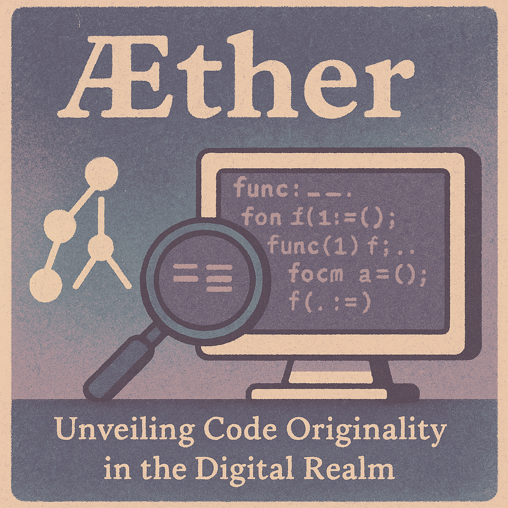

# Æther



---

## Unveiling Code Originality in the Digital Realm

Æther is an advanced source code similarity detection system developed as part of the TC3002B.201 challenge. It employs Machine Learning, Compiler techniques, and Quantitative Methods to identify similarities, patterns, and potential copyright infringements across codebases with high accuracy and efficiency.

## ✨ Features

-   **Signature Analysis**: detect unique fingerprints in code structure beyond simple text matching
-   **Multi-Language Support**: analyze code patterns across various programming languages.
-   **AST Comparison**: compare Abstract Syntax Trees to identify structural similarities regardless of formatting or variable renaming.
-   **Quantitative Similiraty Metrics**: apply statistical methods to determine similarity probabilities.
-   **Academic & Research Focus**: built with reference to state-of-the-art research methods cited in academic literature.
-   **Batch Processing**: process entire repositories or multiple files at one.

## 🚀 Installation

### Prerequisites

-   Python 3.10 or higher
-   Git
-   Conda 10.7 or higher

### Using Pip

```bash
# Clone the repository
git clone https://github.com/salgue441/aether.git
cd aether

# Install using pip
pip install .

# Or for development mode or with ML extras
pip install -e ".[dev]"
pip install -e ".[dev,ml,viz]"
```

### Using CONDA

```bash
# Clone the repository
git clone https://github.com/salgue441/aether.git
cd aether

# Create and activate a conda environment
conda env create -f environment.yml
conda activate aether

# Install the package in development mode
pip install -e .
```

### Manual Installation

```bash
# Clone the repository
git clone https://github.com/salgue441/aether.git
cd aether

# Install the core dependencies
pip install numpy scikit-learn torch tree-sitter matplotlib networkx fasttext click tqdm pygments jinja2 transformers

# Install development dependencies
pip install pytest pytest-cov black isort mypy flake8
```

## 🖥️ Command Line Interface

```bash
# Basic comparison between two files
aether compare file1.py file2.py

# Analyze an entire directory against another
aether compare --source path/to/original/repo --target path/to/suspected/repo

# Set custom threshold and output format
aether compare --source file1.py --target file2.py --threshold 0.8 --format json

# Use specific detection methods
aether compare --source dir1 --target dir2 --use-ast --use-ml --skip-comments
```

## ⚙️ Configuration

Æther can be configured through a `pyproject.toml` file in your project or via a separate `aether.toml` configuration file:

```toml
[tool.aether]
# Detection settings
threshold = 0.75
ignore_comments = true
consider_variable_names = false
min_token_length = 3

# Machine learning model settings
use_ml_model = true
model_path = "models/similarity_model.pkl"
embedding_dim = 128

# AST analysis settings
use_ast = true
normalize_identifiers = true
consider_structure_only = false

# Output settings
output_format = "html"
include_snippets = true
include_metrics = true

# Languages to support
languages = [
    "python",
    "java",
    "cpp",
]
```

## 🌌 How It Works

Æther operates by combining multiple advanced techniques as referenced in academic research (Đurić & Gašević, 2013; Chilowicz et al., 2009; Ragkhitwetsagul et al., 2018; Alomari & Harbi, 2019):

1. **Tokenization** source code to remove formatting and standardize representation.
2. **Generating Abstract Syntax Trees (AST)** to understand code structure beyond text.
3. **Creating fingerprints** using locally-sensitive hashing algorithms.
4. **Deep Learning Embeddings** using PyTorch and CodeBERT to capture semantic meaning of code.
5. **Neural Similarity Detection** leveraging transformer architecture to identify similar code intent despite different implementations.
6. **Statistical Analysis** using probability calculations to determine similarity scores.
7. **Comparing similarities** using various metrics (Jaccard index, cosine similarity).
8. **Filtering results** based on configured thresholds and known patterns.
9. **Generating reports** highlights probable instances of code duplication with confidence scores.

## 🔍 Use Cases

-   **Academic Research**: detect plagiarism in student programming assignments.
-   **Copyright Protection**: identify potential infringements of intellectual property rights in source code.
-   **Open Source Compliance**: ensure code doesn't violate licenses or copy protected work.
-   **Research Validation**: compare our solution against state-of-the-art methods to demonstrate efficiency.
-   **Educational Tool**: help students understand the boundaries of code reuse and proper attribution.
-   **IP Protection**: safeguard proprietary algorithms and implementations from unauthorized use.
-   **Code Quality**: identify redundant implementations within your own codebase.

## 📚 Research Foundation

This project is developed based on research cited in the TC3002B.201 challenge, including:

-   ĐURIĆ, Zoran; GAŠEVIĆ, Dragan. A source code similarity system for plagiarism detection. The Computer Journal, 2013, vol. 56, no 1, p. 70-86.
-   CHILOWICZ, Michel; DURIS, Etienne; ROUSSEL, Gilles. Syntax tree fingerprinting for source code similarity detection. In 2009 IEEE 17th international conference on program comprehension. IEEE, 2009. p. 243-247.
-   RAGKHITWETSAGUL, Chaiyong; KRINKE, Jens; CLARK, David. A comparison of code similarity analysers. Empirical Software Engineering, 2018, vol. 23, no 4, p. 2464-2519.
-   ALOMARI, Firas; HARBI, Muhammed. Scalable Source Code Similarity Detection in Large Code Repositories. arXiv preprint arXiv:1907.11817, 2019.

## 📜 License

This project is licensed under the MIT License - see the [LICENSE](LICENSE) file for details.

## 🌟 Acknowledgements

-   Developed as part of the TC3002B.201 challenge.
-   Inspired by research in code similarity detection and copyright infringement prevention.
-   Built with an academic approach to addressing real-world intellectual property challenges.
-   Special thanks to the contributors who made this project possible.

---

<p align="center">Exploring the unseen connections between lines of code</p>
